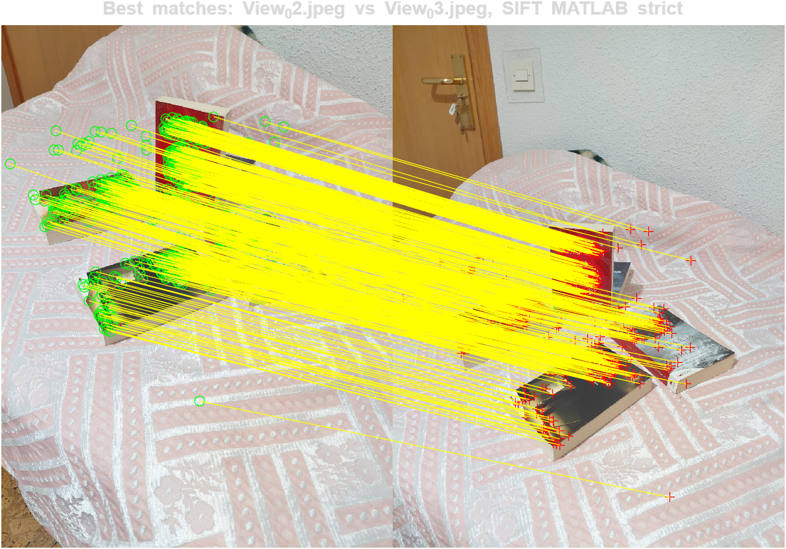
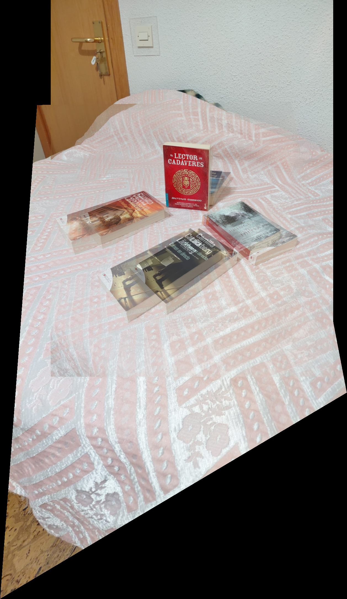
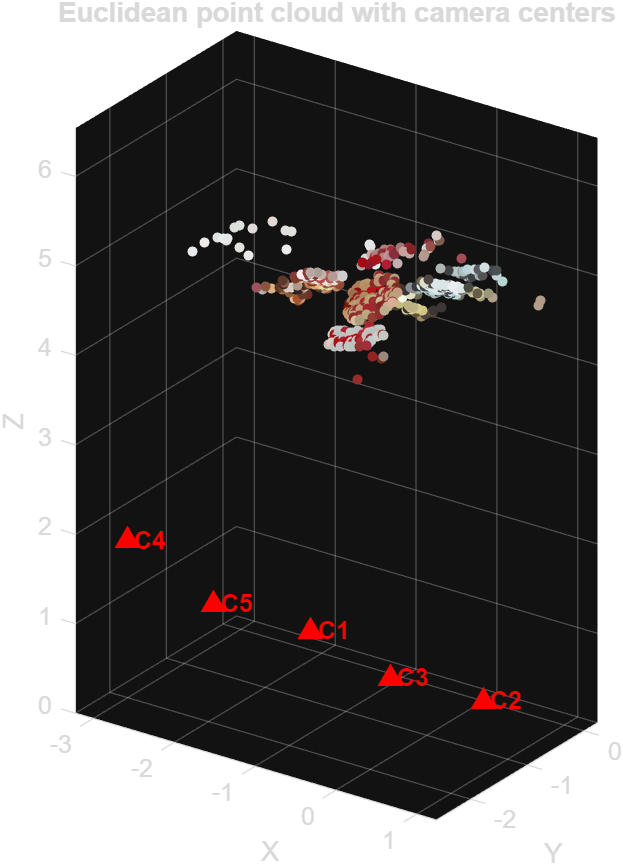
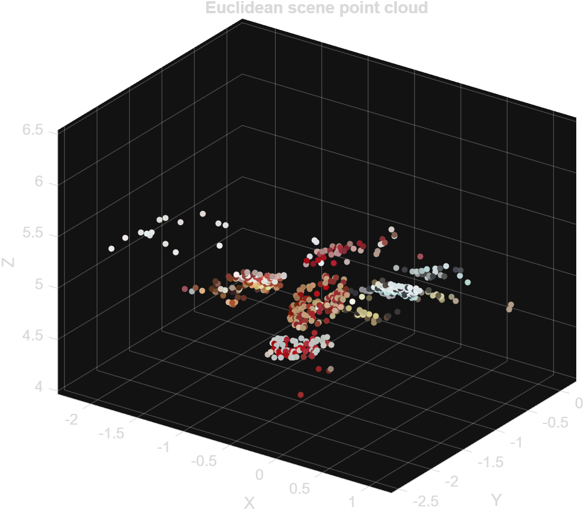
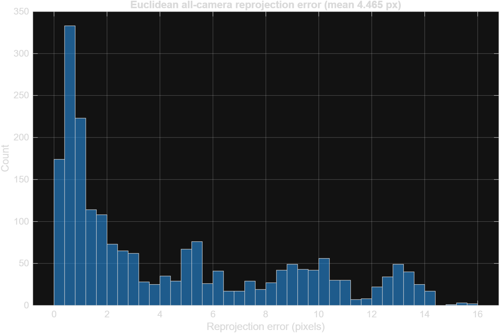

# Calibrated Multi-View 3D Reconstruction

Camera calibration, feature matching, panorama estimation, epipolar-geometry validation, and sparse 3D reconstruction from real captured images.

This project is a complete MATLAB pipeline for recovering 3D scene structure from multiple moving-camera views. It starts with camera calibration from planar patterns, evaluates local feature matching across real scene images, estimates two-view geometry with RANSAC, and finishes with a multi-view sparse point-cloud reconstruction.

The work was originally developed for a 3D Vision for Multiple and Moving Cameras lab, then reorganized as a portfolio-ready project with reproducible entrypoints, saved metrics, visual results, report assets, and clear documentation.

## Table Of Contents

- [Overview](#overview)
- [What This Project Demonstrates](#what-this-project-demonstrates)
- [Pipeline](#pipeline)
- [Visual Results](#visual-results)
- [Results At A Glance](#results-at-a-glance)
- [Repository Layout](#repository-layout)
- [Requirements](#requirements)
- [Setup](#setup)
- [How To Run](#how-to-run)
- [Input Data](#input-data)
- [Generated Outputs](#generated-outputs)
- [Implementation Details](#implementation-details)
- [Troubleshooting](#troubleshooting)
- [Portfolio Notes](#portfolio-notes)
- [Third-Party Code](#third-party-code)

## Overview

The goal is to reconstruct a sparse 3D representation of a real scene from multiple images captured by the same camera. The pipeline is intentionally split into three sections so each major 3D vision concept can be inspected independently:

1. **Camera calibration:** estimate intrinsic camera matrix values from planar calibration views.
2. **Feature matching and two-view geometry:** detect and match local features, then estimate homographies and fundamental matrices.
3. **Multi-view reconstruction:** connect feature matches into tracks, estimate camera matrices, run projective reconstruction, and upgrade the result using calibrated intrinsics.

The project uses saved intermediate files so every stage can be studied through quantitative text reports, figures, matrices, `.mat` files, and a final PDF report.

## What This Project Demonstrates

- Camera calibration using planar homographies.
- Intrinsic matrix estimation and calibration-quality analysis.
- Feature detection and description using SIFT, SURF, and ORB-style matching pipelines.
- Ratio-test matching and geometric match filtering.
- Homography estimation for planar alignment and panorama generation.
- Fundamental matrix estimation with RANSAC.
- Epipolar-geometry inspection through epipolar-line visualization.
- Multi-view feature tracking across five real images.
- Projective reconstruction from an initial image pair.
- Camera resectioning for additional views.
- Bundle adjustment using supplied academic helper routines.
- Essential matrix factorization and Euclidean reconstruction using calibrated intrinsics.
- Report-ready visualization and reproducible result exports.

## Pipeline

### 1. Camera Calibration

Script: `Roy_Gourab_1.m`

The first stage estimates camera intrinsics from two planar calibration setups:

- A digital checkerboard displayed on a screen.
- A custom physical planar pattern based on a floor-tile grid.

For each valid calibration image, the script detects or uses known 2D image points, pairs them with measured real-world coordinates, estimates homographies, and solves for the intrinsic matrix.

Key outputs:

- Intrinsic matrix from the screen checkerboard: `results/section_1/A_screen.mat`
- Calibration metrics: `results/section_1/section1_report_values.txt`
- Calibration montages and reprojection figures.

### 2. Feature Matching And Two-View Geometry

Script: `Roy_Gourab_2.m`

The second stage evaluates feature matching across representative scene-image pairs. It compares several feature setups and records both raw matching counts and geometric quality metrics.

The script estimates:

- Homographies for planar image alignment and panorama creation.
- Fundamental matrices for epipolar geometry.
- Inlier counts and residual errors for each tested pair/setup.

It also runs a per-octave SIFT experiment to show how feature scale affects matching and geometric verification.

Key outputs:

- Setup comparison table: `results/section_2/setup_comparison.csv`
- Best feature matches: `results/section_2/best_matches.png`
- Best panorama: `results/section_2/best_panorama.png`
- Fundamental matrix: `results/section_2/best_fundamental_matrix.txt`
- Epipolar visualization: `results/section_2/vgg_gui_F_best_pair.png`

### 3. Multi-View Reconstruction

Script: `Roy_Gourab_3.m`

The third stage reconstructs a sparse 3D scene from the multi-view image set. It detects scene features, builds feature tracks across views, selects a strong initial pair, reconstructs projectively, adds more cameras through resectioning, and runs bundle adjustment when available.

The project then uses the calibrated intrinsic matrix to form an essential matrix and create a Euclidean reconstruction.

Key outputs:

- Multi-view tracks: `results/section_3/n_view_tracks.mat`
- Initial pair visualization: `results/section_3/initial_pair_matches.png`
- Reprojection histograms for each reconstruction stage.
- Camera and point-cloud visualizations.
- Colored sparse cloud: `results/section_3/colored_cloud.png`

## Visual Results

| Feature matches | Panorama |
| --- | --- |
|  |  |

| Colored reconstruction | Cameras and point cloud |
| --- | --- |
|  |  |

| Scene-only point cloud | Reprojection histogram |
| --- | --- |
|  |  |

## Results At A Glance

| Area | Result |
| --- | --- |
| Calibration images | 7 screen-checkerboard views and 7 custom-pattern views |
| Screen calibration focal lengths | alpha = 1530.29 px, beta = 1526.97 px |
| Screen calibration square-pixel deviation | 0.217550% |
| Screen calibration mean reprojection error | 9.763672 px |
| Best matching pair | `View_02.jpeg` vs `View_03.jpeg` |
| Best matching setup | MATLAB SIFT strict |
| Best raw matches | 1003 |
| Best fundamental-matrix inliers | 714 |
| Best fundamental-matrix Sampson error | 0.183218 |
| Scene images used for reconstruction | 5 |
| Retained multi-view tracks | 672 |
| Initial two-view reprojection error | 0.169020 px |
| Post-resection reprojection error | 0.397073 px |
| Final Euclidean reprojection error | 4.465095 px |
| Bundle adjustment | Completed successfully |

More detailed values are documented in [docs/RESULTS.md](docs/RESULTS.md) and in the generated section reports under `results/`.

## Repository Layout

```text
.
|-- README.md                         # Main project documentation
|-- Roy_Gourab_1.m                    # Section 1: camera calibration
|-- Roy_Gourab_2.m                    # Section 2: feature matching and two-view geometry
|-- Roy_Gourab_3.m                    # Section 3: multi-view reconstruction
|-- run_sceneforge3d.m                # Reproducible entrypoint for one or all sections
|-- setup_sceneforge3d.m              # MATLAB path setup and environment checks
|-- checkerboard.py                   # Optional checkerboard generator
|-- requirements.txt                  # Optional Python helper dependency list
|-- THIRD_PARTY.md                    # Notes on bundled third-party/academic code
|-- PLAN.md                           # Original development plan and lab notes
|-- LabFinal.pdf                      # Original lab statement
|-- Roy_Gourab.pdf                    # Final compiled report copy
|-- docs/
|   |-- PORTFOLIO.md                  # Portfolio summary, resume bullets, topics
|   `-- RESULTS.md                    # Main quantitative result summary
|-- images/
|   |-- calibration_screen/           # Screen checkerboard calibration images
|   |-- calibration_custom/           # Custom planar-pattern calibration images
|   |-- scene/                        # Multi-view scene images
|   `-- checkerboard.png              # Calibration pattern image
|-- lib/                              # MATLAB helper functions
|   |-- ACT_lite/                     # Academic reconstruction and BA helpers
|   |-- extra_funs/                   # Extra calibration/reconstruction helpers
|   `-- vgg_gui_F.m                   # Epipolar-geometry visualization helper
|-- results/
|   |-- section_1/                    # Calibration metrics and figures
|   |-- section_2/                    # Matching, F/H matrices, panorama, metrics
|   `-- section_3/                    # Reconstruction, tracks, clouds, metrics
|-- latex_report/                     # LaTeX report source and compiled PDF
`-- vlfeat-0.9.21/                    # Optional VLFeat dependency
```

## Requirements

### Required

- MATLAB.
- Image Processing Toolbox.
- Computer Vision Toolbox.

The current scripts were verified with MATLAB R2025a on Windows.

### Optional

- VLFeat 0.9.21. The project includes the VLFeat folder, but the scripts can fall back to MATLAB's built-in SIFT support when compiled VLFeat MEX files are unavailable.
- Python 3.10+ for regenerating the optional checkerboard image.
- Pillow for the checkerboard helper.

Install the optional Python dependency:

```bash
pip install -r requirements.txt
```

## Setup

Open MATLAB in the project root and run:

```matlab
setup_sceneforge3d
```

This setup script:

- Moves MATLAB to the project root.
- Adds `lib/` and its subfolders to the MATLAB path.
- Adds the VLFeat toolbox folder if present.
- Checks that the required scripts and folders exist.
- Reports whether MATLAB SIFT support and VLFeat MEX support are available.

Expected setup output on this machine:

```text
Calibrated Multi-View 3D Reconstruction setup complete.
MATLAB SIFT support: available.
VLFeat source/toolbox found, but compiled MEX files were not found for this platform.
```

## How To Run

Run the full pipeline:

```matlab
run_sceneforge3d
```

Run individual sections:

```matlab
run_sceneforge3d("section1")      % camera calibration
run_sceneforge3d("section2")      % feature matching and two-view geometry
run_sceneforge3d("section3")      % multi-view reconstruction
```

Section order matters:

- Section 2 expects `results/section_1/A_screen.mat` from Section 1.
- Section 3 expects Section 1 calibration data and Section 2 matching metrics.

## Input Data

The repository already includes the image data used for the current results.

### Calibration Images

- `images/calibration_screen/`: images of a displayed checkerboard.
- `images/calibration_custom/`: images of a custom planar floor-tile pattern.

### Scene Images

- `images/scene/`: five scene views captured with the calibrated camera.

The scene views are resized internally for feature matching and reconstruction. The intrinsic matrix is scaled accordingly.

### Optional Checkerboard Regeneration

If Python and Pillow are installed, regenerate the calibration checkerboard with:

```bash
python checkerboard.py
```

Custom size example:

```bash
python checkerboard.py --size 1080 --squares 8 --output images/checkerboard.png
```

## Generated Outputs

### Section 1: Calibration

- `results/section_1/A_screen.mat`
- `results/section_1/A_custom.mat`
- `results/section_1/section1_metrics.mat`
- `results/section_1/section1_report_values.txt`
- `results/section_1/montage_screen.png`
- `results/section_1/montage_custom.png`
- `results/section_1/reprojection_screen.png`
- `results/section_1/reprojection_custom.png`

### Section 2: Matching And Geometry

- `results/section_2/setup_comparison.csv`
- `results/section_2/section2_metrics.mat`
- `results/section_2/section2_report_values.txt`
- `results/section_2/best_matches.png`
- `results/section_2/best_panorama.png`
- `results/section_2/best_homography.txt`
- `results/section_2/best_fundamental_matrix.txt`
- `results/section_2/per_octave_results.png`
- `results/section_2/vgg_gui_F_best_pair.png`

### Section 3: Reconstruction

- `results/section_3/n_view_tracks.mat`
- `results/section_3/section3_metrics.mat`
- `results/section_3/section3_report_values.txt`
- `results/section_3/initial_pair_matches.png`
- `results/section_3/initial_F.txt`
- `results/section_3/F_from_P.txt`
- `results/section_3/essential_matrix.txt`
- `results/section_3/euclidean_intrinsic_matrix.txt`
- `results/section_3/colored_cloud.png`
- `results/section_3/cloud_with_cameras_view_1.png`
- `results/section_3/cloud_with_cameras_view_2.png`
- `results/section_3/cloud_scene_only_view_1.png`
- `results/section_3/cloud_scene_only_view_2.png`

The final written report is available at:

- `Roy_Gourab.pdf`
- `latex_report/Roy_Gourab.pdf`

## Implementation Details

### Calibration

The calibration stage follows the standard planar-pattern approach:

1. Detect or define corresponding 2D image points and 2D world-plane points.
2. Estimate one homography per calibration view.
3. Solve for camera intrinsics from homography constraints.
4. Evaluate focal lengths, skew, aspect ratio, principal point, and reprojection error.

### Feature Matching

The feature-matching stage compares multiple configurations:

- MATLAB SIFT default.
- MATLAB SIFT strict.
- SURF with `matchFeatures`.
- ORB with `matchFeatures`.

For each pair/setup, the script records keypoint counts, match counts, homography inliers, homography residuals, fundamental-matrix inliers, Sampson error, and runtime.

### Reconstruction

The reconstruction stage uses:

- SIFT keypoints and descriptors.
- Multi-view track construction from pairwise matches.
- Initial pair selection based on track support.
- Projective reconstruction from the initial pair.
- Resectioning to add remaining cameras.
- Projective bundle adjustment when the helper routine succeeds.
- Essential matrix factorization to recover Euclidean camera motion.
- Reprojection-error analysis and point-cloud visualization.

## Troubleshooting

### `Missing Section 1 intrinsic matrix`

Run Section 1 before Section 2 or Section 3:

```matlab
run_sceneforge3d("section1")
```

### `VLFeat executable MEX files were not found`

This is acceptable if MATLAB's built-in SIFT functions are available. The scripts automatically use the MATLAB SIFT fallback.

### `detectSIFTFeatures` is unavailable

Use a MATLAB version/toolbox that supports SIFT, or compile VLFeat MEX files for your platform.

### Low match count or reconstruction failure with new images

Use more overlapping scene views, avoid motion blur, keep camera intrinsics fixed, and choose textured objects with strong corners or printed patterns.

### Path errors

Make sure MATLAB is opened at the project root and run:

```matlab
setup_sceneforge3d
```

## Portfolio Notes

Recommended portfolio title:

**Calibrated Multi-View 3D Reconstruction**

Short description:

> Built a MATLAB multi-view vision pipeline that calibrates a real camera, verifies feature matches with epipolar geometry, and reconstructs a sparse 3D scene from multiple moving-camera views.

Suggested GitHub topics:

```text
computer-vision, 3d-reconstruction, camera-calibration, matlab,
epipolar-geometry, sift, bundle-adjustment, multi-view-geometry
```

Best visuals to show:

- `results/section_2/best_matches.png`
- `results/section_2/best_panorama.png`
- `results/section_3/colored_cloud.png`
- `results/section_3/cloud_with_cameras_view_1.png`

Additional portfolio-ready wording is available in [docs/PORTFOLIO.md](docs/PORTFOLIO.md).

## Known Limitations

- The reconstruction is sparse rather than dense.
- Final Euclidean reconstruction quality depends on calibration accuracy and feature-track consistency.
- The custom planar-pattern calibration has higher error than the digital checkerboard calibration.
- VLFeat is included as source/toolbox support, but compiled MEX files may need to be built separately on a new machine.
- The bundled academic helper code is useful for the lab workflow, but it is not packaged as a standalone MATLAB toolbox.

## Possible Future Improvements

- Add a dense multi-view stereo stage.
- Export the reconstructed cloud to PLY or OBJ.
- Add automated tests for helper functions and saved-output validation.
- Add a small MATLAB Live Script demo for easier presentation.
- Replace manual report-value copying with a generated summary table.
- Add a GitHub Actions workflow for static checks of Markdown and Python helper code.

## Third-Party Code

This project includes third-party academic code and VLFeat support files. See [THIRD_PARTY.md](THIRD_PARTY.md) before publishing or relicensing the repository.
